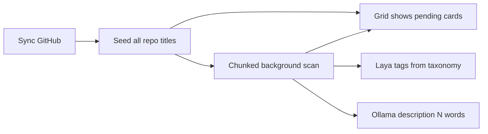

# Leftover ROADMAP features

The current app already covers FIFO cache, Ollama-backed mood/effort/description, GitHub ZIP-in-RAM analysis, chat import, Time Travel prompts, and Graveyard Analytics. Almost everything else in [ROADMAP.md](ROADMAP.md) and the Laya layer in [TECHSTACK.md](TECHSTACK.md) is stubbed or unused.

## Constraint: process in RAM, cache tags and info on disk

Repository **processing and calculation** stay in memory. A small **disk cache is allowed for the tag list and related info** so taxonomy survives a restart.

**Must stay in memory (no ZIP/code/chat dumps):**

- GitHub ZIP bytes in `FIFOCache` (`BytesIO` / `zipfile` only). Never unpack a repo to a folder.
- All calculation: smell/secret/endpoint scans, abandonment score, Laya inference, Ollama prompts, analytics aggregation.
- Chat **file bodies** and parsed conversation text: read from the upload request into RAM. Stop writing `uploads/` copies of ChatGPT/Gemini exports.
- CSV, `WELCOME_BACK.md`, Time Travel, PNG: build in `io.BytesIO` / browser download. Do not write analysis artifacts to `output/`. Drop the [docker-compose.yml](docker-compose.yml) `./output` mount if unused.
- FIFO eviction drops oldest ZIP bytes; in-session repo cards can remain in `state.repos` without the zip.

**May cache on disk (small JSON, not the graveyard):**

- Global tag list (create/rename/delete).
- Tag **info**: names, optional notes/colors, and assignment maps (repo id / chat id → tag ids plus last Laya scores the user cares to keep).
- Lightweight settings that belong with that cache (confidence default, description word budget, chunk size, Laya backend). Browser `localStorage` can still mirror UI prefs.

Load this cache at startup into `StateManager`. CRUDS updates RAM first, then writes the small JSON. Never write ZIP bytes, source files, or full chat dumps into that file.

**Also allowed:** optional HuggingFace model cache if Laya transformers is enabled; container image/packages; user-chosen download of an export.

Hardcoded tags and scores today:

```45:46:app.py
        self.chat_tags = ["backend", "frontend", "debugging", "architecture", "database", "devops"]
        self.repo_tags = ["backend", "frontend", "abandoned", "react", "python", "data_science"]
```

```391:396:app.py
            profile = {
                "id": repo_data['id'], "name": name, "description": desc, ...
                "tags": {"backend": 0.9}, "updated_at": repo_data.get('last_update')
            }
```

Scan currently waits on per-repo commit fetches in the request thread, then only appends a card after full ZIP+LLM analysis. `/api/github/scan` already returns the title list, but [static/js/app.js](static/js/app.js) ignores it and `pollData()` redraws only completed repos.




## Phase 1 — List titles first, refresh on the fly

This is ROADMAP “Seamless Two-Step Batch Processing”.

**Backend ([app.py](app.py))**

- Return from `/api/github/scan` as soon as `user.get_repos(...)` is listed. Do **not** fetch commits in the request thread.
- Immediately seed `state.repos` with shell rows: `id`, `name`/`full_name`, GitHub `description` as placeholder, `updated_at`, `status: pending`.
- Background workers (chunk size from settings) fetch commits, ZIP, smells, Laya tags, Ollama fields, then **update the same row in place** (`status: analyzing` → `ready` / `error`).
- Keep poll payload as `{ repos, scan_in_progress }` plus `analyzed_count` / `total_count` for a status bar.

**Frontend ([static/js/app.js](static/js/app.js), [templates/index.html](templates/index.html))**

- After Sync, paint every title immediately from the scan response (and from the next poll).
- Incremental grid updates by `id` (no full `innerHTML` wipe) so cards do not jump or flicker.
- Show pending vs ready state on each card; update description, mood, tags, effort as they arrive.
- Status text like `Analyzing 5/50 repos...`.

## Phase 2 — Tag CRUDS + Laya decision system + confidence slider

**Taxonomy (global, as ROADMAP requires)**

- Replace hardcoded `chat_tags` / `repo_tags` with one list of tags: `{ id, name }` plus optional info fields.
- Persist the tag list and assignment/info cache to a small JSON file (e.g. `data/tags.json`). Load on boot; write on CRUDS. This is the only graveyard-adjacent disk cache.
- REST: `GET/POST/PUT/DELETE /api/tags` plus search query; bulk assign/unassign on selected repo/chat ids.
- Settings (or a Tags panel): create/rename/delete; chips on repo and chat cards; multi-select for bulk ops.

**Laya ([TECHSTACK.md](TECHSTACK.md) System 1)**

- New `LayaDecisionService` used by `RepoAnalyzer` and `ChatAnalyzer`.
- Candidate labels = current user taxonomy (not a fixed list).
- Input: code snippets / chat text **held in RAM**. Output: `{ tagName: probability }` on the in-memory entity; optionally copy scores into the small tag-info cache so assignments survive restart without storing source.
- Implementation: HuggingFace zero-shot (`facebook/bart-large-mnli` or DeBERTa-v3-mnli) behind an optional extra `requirements-laya.txt` (`transformers`). If the model is missing, fall back to Ollama JSON scores over the same label set, then keyword overlap. Never block the title-first grid on Laya.
- Settings: Laya backend (`auto` / `transformers` / `ollama`), optional model id.

**Confidence slider (0–100)**

- Global control in Settings; persist with the tag/info cache and/or localStorage.
- UI hides tags and linker matches below the threshold. Full scores stay on the in-memory entity during the session.

## Phase 3 — Better, adjustable descriptions

Keep the current 1-sentence Ollama path; make length a setting.

- Settings slider: description word budget (e.g. 8–40, default ~18).
- Prompt: `Write a summary of at most {N} words of this code: ...`
- Show GitHub’s own description on the pending card immediately; replace/enhance with the LLM text when ready.
- Optional small improvement without changing the mechanism: prepend repo language/name in the prompt; clamp the returned text to N words.

Chat ROADMAP still wants a **4-word title** + 1-sentence summary + language flag. Use the same word-budget setting for the sentence; keep the title strictly 4 words. Extractive stage: rank top 3 sentences with a local TF-IDF/TextRank (no extra LLM) then pass those to Ollama.

## Phase 4 — Remaining chat corpus

- Keep the original upload bytes and parsed conversations on `state` only. Remove `uploads/` writes and folder usage from upload/list/delete.
- Render `state.conversations` into `#chatContainer` (currently unused) with ChatGPT vs Gemini badges.
- Closure analysis already exists; keep it.
- Topic-shift split: if consecutive user turns have low lexical overlap, split into sub-chats.
- Complexity: `Quick Question` if ≤3 turns, else `Deep Work`.
- Store `four_word_title`, `summary`, `language`, `complexity`, `tags` from Laya.

## Phase 5 — Deep code extraction leftovers

In `RepoAnalyzer.analyze`, actually fill fields that are declared but empty:

- `tech_stack` from `package.json` / `requirements.txt` / `Cargo.toml` in the ZIP.
- `env_vars` from `.env` / `config.json` keys, values blanked.
- `db_schemas` from Prisma/Mongoose/SQLAlchemy-ish patterns.
- API endpoint ledger from `route` / `router.` / `@app.` patterns.
- Console-log auditor (`console.log`, `print`, `var_dump`).
- Abandonment score as a mix of age, TODO count, smell density (not days-only).
- Custom-vs-boilerplate: skip vendor/lockfile paths when counting `custom_lines`.
- Version decay: flag obviously ancient major versions from manifests (local heuristics; no live CVE DB required unless we add a small bundled list).

## Phase 6 — Export, WELCOME_BACK.md, AI Linker

- CSV export of the active repo grid with a field picker. Build the file in memory and stream the download (`BytesIO` / `send_file`); never write `output/`.
- `WELCOME_BACK.md` same pattern: generate in RAM, download as attachment.
- AI Linker modal: rank chats by overlapping Laya tag scores above the confidence slider; feed the best match into Time Travel instead of `state.conversations[0]`.
- Analytics `ai_match_score`: derive from real linker overlap, not `len(conversations) * 10`.

## Phase 7 — Scan UX and settings leftover

- Collapsible live log from existing `state.scan_log` (`GET /api/scan_log`).
- Chunk-size setting for the background queue (pairs with Phase 1).
- Cache slider min 5 / max 20 to match ROADMAP (today min is 1).
- Persist description word count, chunk size, confidence, Laya backend with `/api/settings` (tag/info JSON cache, not repo ZIPs).

## Phase 8 — Rewrite README as a professional product description

Replace the current short “V7” marketing [README.md](README.md) with a complete, professional document that describes **all** functionality—what already ships and what this work completes—without changelog tone or emoji-heavy headlines.

Structure:

- **What it is:** Local resurrection suite. Repository ZIP processing and all scoring stay in RAM. The tag list and tag info may be cached on disk. No clone-to-disk, no `uploads/` of chat exports, no `output/` of generated files.
- **How it works:** Dual-engine architecture (Laya/System 1 for tags and scores; Ollama/System 2 for summaries, mood, effort, chat closure). Two-step sync: all repository titles appear immediately, then cards refresh as ZIP analysis, Laya tagging, and Ollama descriptions finish.
- **Repository graveyard:** FIFO RAM cache (5–20 repos), smell/secret/TODO/endpoint/schema/tech-stack extraction, multi-factor abandonment score, adjustable-length descriptions, Time Travel master prompt, `WELCOME_BACK.md`, CSV export.
- **Chat corpus:** ChatGPT JSON and Gemini HTML/JSON import, platform badges, closure (`SOLVED` / `CONTEXT_LOST` / `TIMEOUT`), extractive then abstractive titles/summaries, language flag, topic-shift splits, complexity buckets.
- **Taxonomy and linking:** Global tag CRUDS, bulk assign, Laya probabilities, confidence slider, AI Linker ranking chats against a repo.
- **Analytics:** Coma Index, Mood X-Ray, resurrection T-shirt cost, AI corpus match score, PNG export.
- **Operations:** Settings (GitHub PAT, Ollama URL/model, cache, chunk size, description word budget, Laya backend, confidence), progress bar, collapsible scan log.
- **Setup:** `docker-compose`, localhost, required PAT and local Ollama; optional Laya/`transformers` extra. Brief note on what stays local.

Write for an engineer reading the repo for the first time. Keep setup accurate to [docker-compose.yml](docker-compose.yml). Do not invent APIs or flags that the implementation does not provide.

## Phase 9 — Update ROADMAP.md

Rewrite [ROADMAP.md](ROADMAP.md) so it is a current product PRD, not a leftover draft. Clean the escaped markdown (`\#`, `\*`) into normal headings and lists. Keep the existing section structure where it still fits, and fold in the decisions from this plan.

Must include:

- **RAM vs disk:** ZIP cache, chat bodies, and all calculation stay in memory. Chat imports never write `uploads/`. Exports never write `output/`. Tag list and tag info (assignments, optional scores) cache to a small JSON file. Restart clears processed repos/chats; taxonomy remains. Optional HuggingFace cache if transformers Laya is enabled.
- **Two-step sync:** list all repository titles first; refresh cards in place during background analysis; no grid flicker.
- **Laya:** System 1 assigns probabilities over the **user-managed** global taxonomy for both repos and chats; confidence slider filters display and AI Linker matches.
- **Descriptions:** adjustable word budget for repo summaries; chat 4-word title + one-sentence summary still specified.
- **Exports:** CSV and `WELCOME_BACK.md` as in-memory downloads.
- **Settings:** cache 5–20, chunk size, description length, Laya backend, confidence, Ollama, GitHub PAT.
- **Deep extraction and chat pipeline** requirements that this work implements (endpoints, env templates, topic split, complexity, badges).

After implementation, mark or phrase requirements as the intended system of record (not “V7 leftover”). If anything is still deferred, list it in a short **Open items** section at the bottom instead of leaving the Granular Settings section truncated as it is today.

## Files to change

- [app.py](app.py) — scan orchestration, tag APIs, Laya service, richer analyze/export/linker, small JSON cache for tags/info.
- [templates/index.html](templates/index.html) — tags UI, sliders, chat feed, linker/export/log.
- [static/js/app.js](static/js/app.js) — keyed live grid, bulk tags, poll status.
- [static/css/style.css](static/css/style.css) — chips, pending cards, badges, log.
- [requirements.txt](requirements.txt) + optional `requirements-laya.txt`.
- [tests/test_chat_parser.py](tests/test_chat_parser.py) plus new tests for tags, stub seeding, description clamp, linker ranking.
- [README.md](README.md) — full professional product description after the features land (or in the same PR, matching shipped behavior).
- [ROADMAP.md](ROADMAP.md) — cleaned PRD aligned with RAM-first architecture, Laya, live title-first scan, and completed settings.

## Out of scope unless it blocks the above

- Replacing Flask/vanilla JS.
- Shipping a GPU DeBERTa image by default (optional extra; Ollama fallback keeps current Docker workable).
- Persisting ZIP contents, full chat exports, or calculated repo profiles across restarts (only tag list and info cache on disk).

